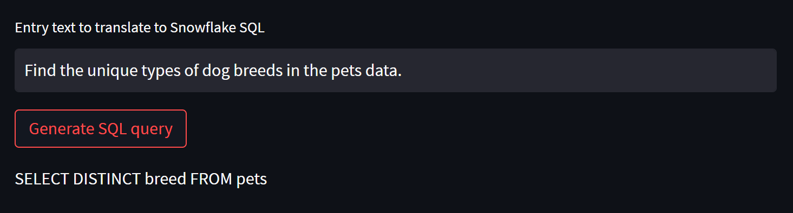
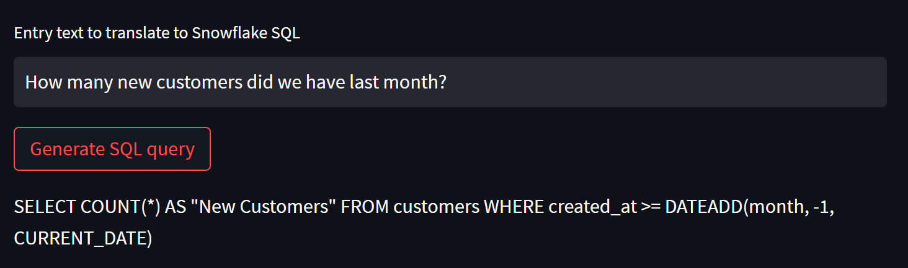
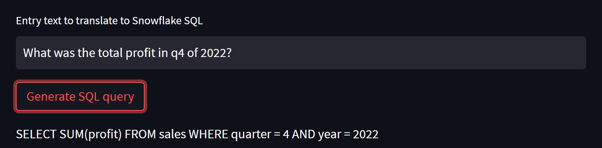

<a name="readme-top"></a>

[![Contributors][contributors-shield]][contributors-url]
[![Forks][forks-shield]][forks-url]
[![Stargazers][stars-shield]][stars-url]
[![Issues][issues-shield]][issues-url]
[![MIT License][license-shield]][license-url]
[![LinkedIn][linkedin-shield]][linkedin-url]

<!-- PROJECT LOGO -->
<br />
<div align="center">
  <a href="https://github.com/adamduval/sqlai">
    
  </a>

<h3 align="center">sqlai</h3>

  <p align="center">
    A naive natural language to SQL query translator using OpenAI, Python and Streamlit.   
  </p>
</div>


<!-- TABLE OF CONTENTS -->
<details>
  <summary>Table of Contents</summary>
  <ol>
    <li>
      <a href="#about-the-project">About The Project</a>
      <ul>
        <li><a href="#built-with">Built With</a></li>
      </ul>
    </li>
    <li>
      <a href="#getting-started">Getting Started</a>
      <ul>
        <li><a href="#installation">Installation</a></li>
      </ul>
    </li>
    <li><a href="#usage">Usage</a></li>
    <li><a href="#license">License</a></li>
    <li><a href="#contact">Contact</a></li>
    <li><a href="#acknowledgments">Acknowledgments</a></li>
  </ol>
</details>


<!-- ABOUT THE PROJECT -->
## About The Project

This project uses a call to the OpenAI API to translate a natural language question into a sql query. It is a naive translation as the call makes to reference to underlying data structures.


<br></br>

<br></br>


<p align="right">(<a href="#readme-top">back to top</a>)</p>


### Built With

* [![Python][Python.org]][Python-url]

<p align="right">(<a href="#readme-top">back to top</a>)</p>


<!-- GETTING STARTED -->
## Getting Started

This is an example of how you may give instructions on setting up your project locally.
To get a local copy up and running follow these simple example steps.


### Installation

1. Get a API Key from [OpenAI](https://openai.com)
2. Clone the repo
   ```sh
   git clone https://github.com/adamduval/sqlai.git
   ```
3. Install required packages
   ```bash
   pip install -r requirements.txt
   ```
4. Enter your API in `.streamlit/secrets.toml`
   ```toml
   pass='ENTER YOUR API KEY'
   ```

<p align="right">(<a href="#readme-top">back to top</a>)</p>

<!-- USAGE EXAMPLES -->
## Usage

Use this space to show useful examples of how a project can be used. Additional screenshots, code examples and demos work well in this space. You may also link to more resources.

_For more examples, please refer to the [Documentation](https://example.com)_

<p align="right">(<a href="#readme-top">back to top</a>)</p>

<!-- LICENSE -->
## License

Distributed under the MIT License. See `LICENSE.txt` for more information.

<p align="right">(<a href="#readme-top">back to top</a>)</p>

<!-- CONTACT -->
## Contact

Adam Duval - adam@adamduval.com

Project Link: [https://github.com/adamduval/sqlai](https://github.com/adamduval/sqlai)

<p align="right">(<a href="#readme-top">back to top</a>)</p>


<!-- ACKNOWLEDGMENTS -->
## Acknowledgments

* [A Step-by-Step Tutorial on Building a Natural Language to SQL Query App using Openai API](https://medium.com/@lamisghoualmi/a-step-by-step-tutorial-on-building-a-natural-language-to-sql-query-app-using-openai-api-2364de3f234)
* [Best-README-Template](https://github.com/othneildrew/Best-README-Template)


<p align="right">(<a href="#readme-top">back to top</a>)</p>


[contributors-shield]: https://img.shields.io/github/contributors/adamduval/sqlai.svg?style=for-the-badge
[contributors-url]: https://github.com/adamduval/sqlai/graphs/contributors
[forks-shield]: https://img.shields.io/github/forks/adamduval/sqlai.svg?style=for-the-badge
[forks-url]: https://github.com/adamduval/sqlai/network/members
[stars-shield]: https://img.shields.io/github/stars/adamduval/sqlai.svg?style=for-the-badge
[stars-url]: https://github.com/adamduval/sqlai/stargazers
[issues-shield]: https://img.shields.io/github/issues/adamduval/sqlai.svg?style=for-the-badge
[issues-url]: https://github.com/adamduval/sqlai/issues
[license-shield]: https://img.shields.io/github/license/adamduval/sqlai.svg?style=for-the-badge
[license-url]: https://github.com/adamduval/sqlai/blob/master/LICENSE.txt
[linkedin-shield]: https://img.shields.io/badge/-LinkedIn-black.svg?style=for-the-badge&logo=linkedin&colorB=555
[linkedin-url]: https://linkedin.com/in/adamduval
[product-screenshot]: images/screenshot.png
[Next.js]: https://img.shields.io/badge/next.js-000000?style=for-the-badge&logo=nextdotjs&logoColor=white
[Next-url]: https://nextjs.org/
[React.js]: https://img.shields.io/badge/React-20232A?style=for-the-badge&logo=react&logoColor=61DAFB
[React-url]: https://reactjs.org/
[Vue.js]: https://img.shields.io/badge/Vue.js-35495E?style=for-the-badge&logo=vuedotjs&logoColor=4FC08D
[Vue-url]: https://vuejs.org/
[Angular.io]: https://img.shields.io/badge/Angular-DD0031?style=for-the-badge&logo=angular&logoColor=white
[Angular-url]: https://angular.io/
[Svelte.dev]: https://img.shields.io/badge/Svelte-4A4A55?style=for-the-badge&logo=svelte&logoColor=FF3E00
[Svelte-url]: https://svelte.dev/
[Laravel.com]: https://img.shields.io/badge/Laravel-FF2D20?style=for-the-badge&logo=laravel&logoColor=white
[Laravel-url]: https://laravel.com
[Bootstrap.com]: https://img.shields.io/badge/Bootstrap-563D7C?style=for-the-badge&logo=bootstrap&logoColor=white
[Bootstrap-url]: https://getbootstrap.com
[JQuery.com]: https://img.shields.io/badge/jQuery-0769AD?style=for-the-badge&logo=jquery&logoColor=white
[JQuery-url]: https://jquery.com 
[Python.org]: https://img.shields.io/badge/Python-14354C?style=for-the-badge&logo=python&logoColor=white
[Python-url]: https://python.org